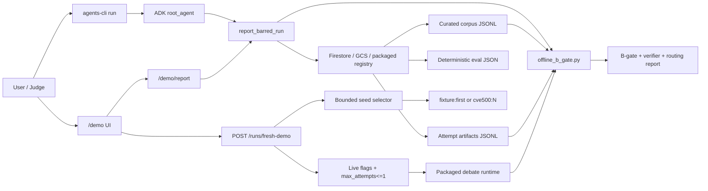

# BARRED-Fleet

BARRED-Fleet is a Google ADK + Cloud Run adapter for an auditable multi-agent security-reasoning harness.

It turns a disclosed existing BARRED research workflow into a cloud-hosted enterprise-agent demo surface: one short run ID resolves to deterministic artifacts, B-gate status, verifier metrics, model routing, deterministic eval results, and provenance notes.

## Problem

AI-generated security labels are cheap to produce and expensive to trust. A model can claim a vulnerability is real, but a security team still needs to know:

- what evidence anchored the claim,
- which model roles were involved,
- whether a verifier audited the mechanism,
- whether weak or unsupported outputs were rejected,
- whether the final acceptance decision came from deterministic governance rather than model self-report.

BARRED-Fleet makes that acceptance layer visible.

## What This Demo Shows

The deployed demo uses the curated run `pilot-v1-calibrated-pecan`.

It reports:

- B-gate pass/fail.
- Accepted and rejected attempt counts.
- Verifier parse/pass rates.
- Asymmetric model routing: `ollama/gemma4:31b-cloud` and `ollama/gpt-oss:120b-cloud`.
- Deterministic eval score.
- Provenance chain: Firestore metadata → private GCS artifacts → deterministic B-gate → ADK narration.
- Artifact provenance and cache-telemetry caveat.
- A bounded fresh-debate control path: choose `fixture:first` or `cve500:N`, preview seed provenance, then run one live attempt only when server-side live flags are enabled.

The demo prompt is intentionally short:

```text
Report the BARRED run pilot-v1-calibrated-pecan in concise JSON.
```

The agent resolves the known run through a run registry without requiring the user to provide internal artifact paths. The deployed service now uses Firestore metadata pointing to private GCS artifacts; the GCS registry JSON and packaged local registry remain fallbacks.

Optional cloud registry inputs are supported behind the same run-id interface:

```text
BARRED_RUN_REGISTRY_GCS_URI=gs://gem-creation-barred-fleet-artifacts/registry/run_registry.json
BARRED_RUN_REGISTRY_FIRESTORE_COLLECTION=barred_runs
BARRED_RUN_REGISTRY_FIRESTORE_PROJECT=gem-creation
BARRED_RUN_REGISTRY_FIRESTORE_DATABASE=barred-fleet
BARRED_GCS_ARTIFACT_CACHE_DIR=/tmp/barred-fleet-artifacts
```

Resolution order is Firestore document, GCS registry JSON, local registry JSON, then packaged demo fixture fallback. Artifacts referenced with `gs://` are materialized to the local cache before deterministic B-gate/eval code reads them.

## Google Cloud Proof

Cloud Run service:

```text
service: barred-fleet
region: us-east1
project: gem-creation
validated safe UI revision: barred-fleet-00038-skl
runtime service account: barred-fleet-runtime@gem-creation.iam.gserviceaccount.com
demo URL: https://barred-fleet-837262597425.us-east1.run.app/demo
artifact bucket: gs://gem-creation-barred-fleet-artifacts
metadata database: projects/gem-creation/databases/barred-fleet
metadata collection: barred_runs
```

Security posture:

- The service was temporarily made public to capture browser proof.
- After capture, public access was removed.
- Unauthenticated `/demo` access returned `HTTP/2 403`.
- Authenticated ADK calls still work with `agents-cli run`.
- Firestore resolves `pilot-v1-calibrated-pecan` to private `gs://` artifacts.

Captured proof is indexed in `demo/README.md`.

## Agent Handoff Docs

For future agents or post-submission continuation:

- `docs/BARRED_FLEET_AGENT_HANDOFF.md` records the current deployed state, verification commands, IAM/GCS/Firestore details, and failure recovery notes.
- `docs/BARRED_FLEET_ROADMAP_EXECUTION_PLAN.md` sequences the post-submission roadmap from GCS upload lifecycle through fresh cloud debate execution and reflection/Pareto evolution.
- `docs/SUBMISSION_FREEZE_CHECKLIST.md` captures the Devpost lock checklist, disclosure requirements, and no-overclaim rules.
- `docs/BARRED_FLEET_ARCHITECTURE.md` contains the one-page demo architecture diagram and path-by-path explanation.

## Architecture



The LLM narrates the report. The B-gate decision is computed by deterministic code.

## Hackathon Disclosure

This project is not claiming that the entire BARRED research harness was created from scratch during the hackathon.

Pre-existing work reused:

- Local BARRED debate scenario under `../scenarios/debate/`.
- Existing Agentbeats runtime primitives under `../src/agentbeats/`.
- Existing corpus generation, replay, checkpoint, verifier, and offline B-gate logic.
- Earlier seed-expansion, pre-filter, graph-extractor, and evaluation docs/experiments.

New hackathon work:

- This `barred-fleet/` Google ADK project.
- Cloud Run deployment target and packaged demo runtime.
- Dedicated Cloud Run runtime identity.
- Run-id-only artifact resolution for the curated demo run.
- Bounded seed selector for `fixture:first` and packaged `cve500:N` seeds.
- Gated fresh-debate endpoint and UI controls with dry-run-first behavior.
- Read-only `/demo` and `/demo/report` surfaces.
- ADK eval/report fixtures and deterministic report contract.
- Demo evidence package.

## Current Limitations

- The primary validated result remains the curated BARRED run `pilot-v1-calibrated-pecan`.
- The fresh-debate path is bounded for demo safety: dry-run preview first, `max_attempts=1`, and live execution only when `BARRED_ENABLE_LIVE_FRESH_DEBATE=true` and `BARRED_START_INTERNAL_DEBATE_STACK=true`.
- A fresh selected seed can legitimately fail B-gate; that is a truthful result, not a UI failure.
- Graph/prefilter behavior is intentionally optional and not part of the demo claim.
- Model Armor and Agent Gateway are implemented as guarded safety/egress receipt paths; they do not decide vulnerability acceptance. Memory Bank, Agent Registry, and long-running Agent Runtime deployment are not implemented yet.
- Cassette replay is local deterministic replay evidence, not provider-side prompt/KV cache telemetry.

## Local Setup

Prerequisites:

- Python `>=3.11`
- `uv`
- Google Cloud SDK
- `agents-cli`

Install Agents CLI if needed:

```bash
uv tool install google-agents-cli
uvx google-agents-cli setup
```

Install dependencies:

```bash
cd barred-fleet
agents-cli install
```

Run unit tests:

```bash
make test-unit
```

Expected current result:

```text
140 passed
```

## Demo Commands

Authenticated cloud smoke:

```bash
make demo-smoke
```

Equivalent explicit command:

```bash
agents-cli run \
  --url https://barred-fleet-837262597425.us-east1.run.app \
  --mode adk \
  "Report the BARRED run pilot-v1-calibrated-pecan in concise JSON."
```

Local deterministic eval grading:

```bash
make eval-report-grade-deterministic
```

Browser demo path:

```text
https://barred-fleet-837262597425.us-east1.run.app/demo
```

The browser route requires authentication when Cloud Run is private.

Fresh-debate dry-run verification:

```bash
make verify-fresh-demo
```

This verifies `POST /runs/fresh-demo` planning and confirms live fresh execution still refuses safely unless `BARRED_ENABLE_LIVE_FRESH_DEBATE=true`.

Fresh-debate selector examples:

```bash
TOKEN="$(gcloud auth print-identity-token)"
curl -sS \
  -H "Authorization: Bearer ${TOKEN}" \
  -H "Content-Type: application/json" \
  -X POST \
  "https://barred-fleet-837262597425.us-east1.run.app/runs/fresh-demo" \
  -d '{"seed_id":"cve500:0","run_id":"seed-selector-cloud-smoke","dry_run":true,"max_attempts":1}'
```

Expected dry-run result:

```text
status: planned
seed_metadata.source: cve500
seed_metadata.source_file: scenarios/debate/cve_seeds_500.jsonl
```

Live bounded execution is intentionally opt-in:

```text
BARRED_ENABLE_LIVE_FRESH_DEBATE=true
BARRED_START_INTERNAL_DEBATE_STACK=true
BARRED_MAX_LIVE_FRESH_ATTEMPTS=1
```

Keep those flags off unless recording a bounded live proof.

Packaged internal debate stack verification:

```bash
make verify-packaged-stack
```

This starts the packaged judge/pro/con/verifier localhost A2A services, verifies the judge becomes reachable, then confirms cleanup. It does not run model inference.

## Deployment

Deploy to Cloud Run:

```bash
agents-cli deploy \
  --project gem-creation \
  --region us-east1 \
  --service-account barred-fleet-runtime@gem-creation.iam.gserviceaccount.com \
  --min-instances 0 \
  --max-instances 1 \
  --concurrency 1 \
  --no-confirm-project
```

The deploy command uses private access by default via `--no-allow-unauthenticated`.

## Demo Script

1. Show the Cloud Run service and revision in Google Cloud Console.
2. Show runtime identity `barred-fleet-runtime@gem-creation.iam.gserviceaccount.com`.
3. Run `make demo-smoke` or the explicit `agents-cli run` command.
4. Open `/demo` while authenticated or show the captured browser recording.
5. Explain that the user provides only a run ID; BARRED-Fleet resolves artifacts and computes B-gate results.
6. Point out the provenance chain, accepted rows, verifier parse/pass rates, model routing, deterministic eval score, and provenance note.
7. Show seed preview and bounded live control; explain that live execution is server-flag gated and a fresh run may pass or fail B-gate.
8. Close with limitations and roadmap: async jobs, artifact lifecycle hardening, managed memory/registry exploration, and reflection/Pareto prompt evolution.

## Files To Review

- `app/agent.py`: ADK root agent and tool registration.
- `app/run_registry.py`: local run-id to artifact resolver.
- `app/tools.py`: deterministic BARRED report and B-gate adapters.
- `app/demo.py`: read-only demo report and HTML rendering.
- `app/fast_api_app.py`: FastAPI routes, ADK app wrapper, and Cloud Run entry point.
- `barred_runtime/run_registry.json`: packaged curated run registry.
- `tests/unit/test_tools.py`: deterministic adapter tests.
- `tests/unit/test_run_registry.py`: run registry resolver tests.
- `tests/unit/test_demo.py`: demo surface tests.
- `demo/README.md`: captured proof index.
