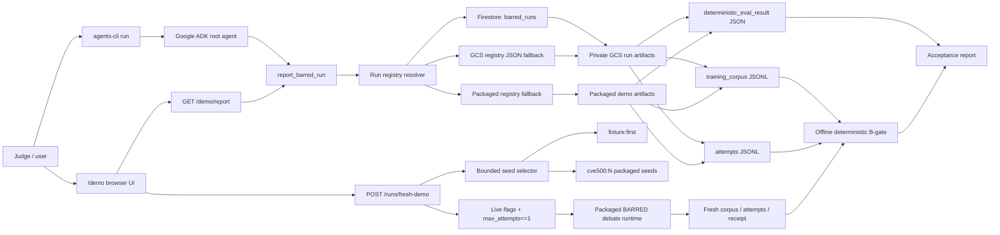

# BARRED-Fleet Architecture

## Current Submission Architecture



## Two Demo Paths

### Curated Validated Report

This is the primary proof path for the submission:

```text
run_id: pilot-v1-calibrated-pecan
Firestore metadata -> private GCS artifacts -> deterministic B-gate -> ADK narration
```

Use this path to show the stable B-gate `PASS`, accepted rows, verifier rates, deterministic eval score, model routing, and artifact provenance.

### Fresh Bounded Debate

This is the live control path:

```text
seed_id -> dry-run preview -> optional one-attempt live run -> B-gate report
```

Supported seed IDs:

```text
fixture:first
cve500:N
```

Safety rules:

- The selector never accepts arbitrary local paths.
- The UI previews metadata before live execution.
- Live execution requires `BARRED_ENABLE_LIVE_FRESH_DEBATE=true`.
- Live execution requires `BARRED_START_INTERNAL_DEBATE_STACK=true`.
- Live execution is capped at one attempt by default.
- Fresh runs may pass or fail B-gate; failed B-gate is a valid outcome.

## Google Cloud Components

- Cloud Run hosts the ADK/FastAPI app.
- IAM keeps the service private by default.
- A dedicated service account runs the service: `barred-fleet-runtime@gem-creation.iam.gserviceaccount.com`.
- Firestore stores run metadata for `barred_runs`.
- GCS stores private run artifacts and registry fallback data.
- Cloud Logging/Trace are configured for observability-ready deployment.

## What The LLM Does Not Decide

The LLM does not decide whether a run passes B-gate. The deterministic tool path computes:

- accepted rows;
- rejected rows;
- verifier parse/pass rates;
- anchor match rate;
- deterministic eval receipt status;
- artifact provenance.

The ADK agent narrates the computed facts and makes them easier to inspect.

## Not Yet Implemented

These are roadmap items, not submission claims:

- GCS-backed seed source of truth.
- Long-running asynchronous jobs.
- Agent Gateway.
- Model Armor.
- Memory Bank.
- Agent Registry.
- Reflection/Pareto prompt evolution.
