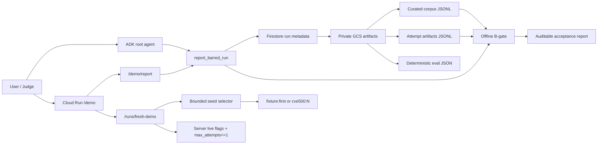

# Devpost Submission Draft: BARRED-Fleet

## Project Name

BARRED-Fleet

## Track

Fortified Enterprise Fleet

Optional prize fit: Startup Excellence, only if submitting through an incorporated organization with the required corporate email.

## One-Line Description

BARRED-Fleet is a Google ADK and Cloud Run agent layer that turns multi-agent security debate artifacts into deterministic, auditable vulnerability-acceptance reports.

## Short Description

Security teams should not accept AI-generated vulnerability labels just because a model sounds confident. BARRED-Fleet wraps an existing BARRED security-debate research harness with a new Google ADK + Cloud Run enterprise-agent surface. A user provides a short run ID, and the deployed agent resolves the correct artifacts, computes deterministic B-gate status, reports verifier metrics, exposes asymmetric model routing, and shows provenance in a browser demo.

## Problem

AI security datasets and agent-review outputs are easy to generate but hard to trust. Hidden prompt changes, model routing, verifier failures, weak anchors, and replay artifacts can all change which examples get accepted. If those accepted rows later become training data or review evidence, unsupported claims become institutional signal.

BARRED-Fleet focuses on the acceptance decision: it makes the evidence trail visible and keeps the final B-gate result deterministic.

## Market Context

Enterprise and frontier-lab evidence point in the same direction: stronger agents are useful, but production trust depends on governance around the agent. IBM's 2026 breach research describes AI-enabled attacks increasing attacker speed and scale, while IBM's AI governance writing emphasizes transparent, explainable, auditable systems. Anthropic's multiagent work highlights coordination and epistemic failure modes that can appear when agents interact at scale.

BARRED-Fleet is our narrow application of that lesson. It does not ask judges or security teams to trust a debate transcript because it sounds plausible. It adds an acceptance-control layer: deterministic B-gate checks, verifier rates, artifact provenance, and model-routing visibility.

## What It Does

- Accepts a short BARRED run ID.
- Resolves the run through a packaged run registry, optional GCS registry JSON, or optional Firestore run document to curated corpus, attempts, and deterministic eval artifacts.
- Computes B-gate pass/fail with deterministic code.
- Reports accepted/rejected rows in a readable decision breakdown.
- Reports verifier parse/pass rates as top-level acceptance health metrics.
- Shows asymmetric model routing across generation, judge, and verifier lanes.
- Shows a visible provenance chain from Firestore metadata to private GCS artifacts to deterministic B-gate output to ADK narration.
- Displays deterministic eval score and artifact provenance.
- Lets a reviewer preview `fixture:first` or packaged `cve500:N` seed metadata before any live debate run.
- Provides a bounded live-debate control path that is capped to one attempt and remains server-flag gated.
- Serves a read-only Cloud Run `/demo` page and `/demo/report` JSON endpoint.

## Google Technologies Used

- Google ADK / `google-adk`
- Google Agents CLI / `agents-cli`
- Gemini 3.5+ compatible ADK orchestration path through Vertex/Gemini configuration
- Google Cloud Run
- Google Cloud IAM / dedicated Cloud Run runtime service account
- Cloud Logging / Trace-ready deployment configuration

## External Context Links

- IBM Cost of a Data Breach 2026 newsroom summary: `https://newsroom.ibm.com/2026-07-29-ibm-study-one-in-four-malicious-breaches-are-ai-enabled%2C-costing-companies-6-million-on-average`
- IBM Trust and Transparency principles: `https://www.ibm.com/policy/blog/trust-principles`
- IBM AI governance discussion: `https://www.ibm.com/think/insights/from-principles-to-actions-building-a-holistic-approach-to-ai-governance`
- Anthropic Responsible Scaling Policy: `https://www.anthropic.com/responsible-scaling-policy`

## Cloud Proof

```text
Cloud Run service: barred-fleet
Project: gem-creation
Region: us-east1
Validated revision: barred-fleet-00038-skl
Runtime identity: barred-fleet-runtime@gem-creation.iam.gserviceaccount.com
Demo URL: https://barred-fleet-837262597425.us-east1.run.app/demo
Artifact bucket: gs://gem-creation-barred-fleet-artifacts
Metadata database: projects/gem-creation/databases/barred-fleet
Metadata collection: barred_runs
```

The service was temporarily public for proof capture, then returned to private IAM-required access. Unauthenticated `/demo` returned `HTTP/2 403` after privacy reset. The current deployment resolves the demo run through Firestore metadata and private `gs://` artifacts.

Proof assets are in `barred-fleet/demo/`.

## Demo Flow

1. Show Cloud Run service `barred-fleet`.
2. Show the deployed revision and scoped runtime identity.
3. Run:

   ```bash
   cd barred-fleet
   make demo-smoke
   ```

4. Show the prompt:

   ```text
   Report the BARRED run pilot-v1-calibrated-pecan in concise JSON.
   ```

5. Show B-gate pass, accepted rows, verifier rates, model routing, deterministic eval score, and provenance.
6. Show the fresh seed preview for `fixture:first` or `cve500:N`.
7. Explain the critical boundary: the ADK agent narrates computed facts, but deterministic tools compute the acceptance result. A fresh selected seed may pass or fail B-gate.

## Architecture



## Results From Demo Fixture

```text
run_id: pilot-v1-calibrated-pecan
B-gate: passed
accepted rows: 5
attempt rows: 17
rejected attempts: 12
verifier parse-ok rate: 1.0
verifier pass rate: 0.75
deterministic eval mean score: 1.0
generator/debater route: ollama/gemma4:31b-cloud
judge/verifier route: ollama/gpt-oss:120b-cloud
```

## What Was Newly Built For The Hackathon

- `barred-fleet/` Google ADK app.
- Cloud Run deployment and FastAPI wrapper.
- Dedicated runtime identity for Cloud Run.
- Run-id-only artifact registry with Firestore metadata and deployed private GCS-backed artifact resolution.
- Bounded seed selector and dry-run-first fresh-debate UI.
- Read-only `/demo` and `/demo/report`.
- Deterministic report contract and unit/eval checks.
- Demo proof package.

## Pre-Existing Work Disclosed

The local BARRED research harness, Agentbeats runtime, replay/checkpoint logic, seed generation workflows, B-gate evaluator, and earlier pre-filter/graph experiments existed before this BARRED-Fleet cloud adapter. They are incorporated as disclosed prior research infrastructure.

## Limitations

- The primary Cloud Run proof is a curated BARRED run; the fresh-debate path is bounded and may pass or fail B-gate depending on the selected seed/output.
- Graph/prefilter experiments are not part of the demo claim.
- Model Armor and Agent Gateway are implemented as safety/egress receipt paths, not acceptance authorities. Memory Bank, Agent Registry, and Agent Runtime remain roadmap items.
- Cassette replay is local deterministic replay, not provider-side cache telemetry.

## Roadmap

- Add production artifact upload/write lifecycle around the current GCS read path.
- Add production run-write lifecycle around the current Firestore metadata read path.
- Harden the current Agent Gateway egress receipt path into a fuller production gateway policy.
- Expand the current Model Armor seed-screening path to additional artifact/output boundaries.
- Move from bounded one-attempt fresh runs to production fresh cloud debate execution.
- Add long-running asynchronous run orchestration.

## Repository

Repository path:

```text
agent_training/silver-one
```

Primary hackathon project path:

```text
agent_training/silver-one/barred-fleet
```
